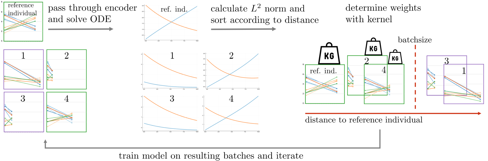

# Deep dynamic modeling with just two time points: Can we still allow for individual trajectories?

## Overview

In this repository, code is hosted to reproduce the results in the [arXiv preprint](https://arxiv.org/abs/2012.00634) on learning individual trajectories by integrating ODE systems into a VAE latent space based on data from only two time points. 

> Maren Hackenberg, Philipp Harms, Thorsten Schmidt and Harald Binder (2020): Deep dynamic modeling with just two time points: Can we still allow for individual trajectories?
> arXiv preprint: https://arxiv.org/abs/2012.00634

## What is it all about? 

The project addresses a questions often coming up in the context of newly set-up epidemiological cohort studies and clinical registries: What can be learned from the data in an early phase of the study, when only a baseline characterization and one (or very few) follow-up measurement are available? 
Since such longitudinal biomedical data are often characterized by a sparse time grid and individual-specific development patterns and are thus challenging to model, we investigate whether combining deep learning with dynamic modeling can be useful for uncovering complex structure in such small data settings. 

Our approach is based on a variational autoencoder (VAE) to obtain a latent representation, where we integrate a system of ordinary differential equations into the VAE latent space for dynamic modeling. We fit individual-specific trajectories by using additional baseline variables to infer individual-specific ODE parameters, thus using implicit regularity assumptions on individuals’ similarity. 

Similarity is a crucial point here more generally: While such an extreme setting with only two time points might seem hopeless for dynamic modeling, irregular spacing of measurements might nevertheless enable modeling of trajectories: If the second measurements of similar individuals occur at different time points, then these aggregated measurements are informative about each individual trajectory. Thus, we explicitly leverage individuals’ similarity in an extension of the approach, where we enrich each individual’s information by assigning it to a group of similar ones and weight individuals’ contribution to the overall loss function according to their similarity.

Using simulated data, we show to what extent the approach can recover individual trajectories from ODE systems with two and four unknown parameters and infer groups of individuals with similar trajectories, and where it breaks down.

## What's in this repo?

In the `scripts` subfolder, you find Julia scripts for different simulation scenarios, i.e., based on a 2-dimensional linear ODE system with 2 unknown parameters (`main_linear2params.jl`), a non-linear system with 2 unknown parameters (`main_nonlinear2params.jl`) and a linear system with 4 unknown parameters, where we train the model on batches of individuals with similar trajectories that are inferred simultaneously with the learned latent trajectories (`main_linear4params.jl`). 

In the `src` subfolder, the source code for the approach can be found, split in different files for separate functionality. Specifically, there are functions for data generation (`simulation.jl`), defining and training the model (`model.jl`), extending the approach on batches of similar individuals (`batches.jl`), benchmarking (`benchmarking.jl`), and plotting (`plotting.jl`). 

In the `notebooks` subfolder, an illustrative introductory jupyter notebook `00_Intro_Overview` is provided that explains about the motivation behind the method with an exemplary application scenario and walks you through a code example step by step. 
Additionally, there is a notebook for each section of the manuscript that reproduces the analysis and figures/tables in that section. 

## How can I get it to run? 

To run the scripts, Julia has to be [downloaded](https://julialang.org/downloads/) and installed. The required packages and their versions are specified in the `Project.toml` and `Manifest.toml` files in the main folder and automatically loaded/installed at the beginning of each script with the `Pkg.activate()` and `Pkg.instantiate()` commands. See [here](https://pkgdocs.julialang.org/v1.2/environments/) for more info on Julia environments. 

To run the Jupyter notebooks with a Julia kernel, the [`IJulia` package](https://github.com/JuliaLang/IJulia.jl) needs to be installed. 
